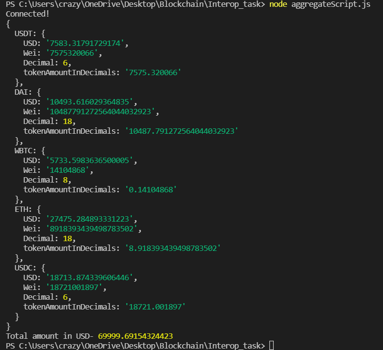

# Interop_task

Interop task

**Script.js**
Queries the Entire Database, Then Uses Javascript to perform 'fees' and 'feesInUSD' summation for tokens and uses decimals of tokens to calculate 'tokenAmountInDecimals' using fees (in Wei).

**aggregateScript.js**
Uses two seperate aggregate queries to get the summation of 'fees' and 'feesInUSD' from supply and withdraw fields seperately and then uses Js to combine the two results and calculate 'tokenAmountInDecimals' using fees (in Wei).

The result displayed is the same from either scripts.
Here is the result-

